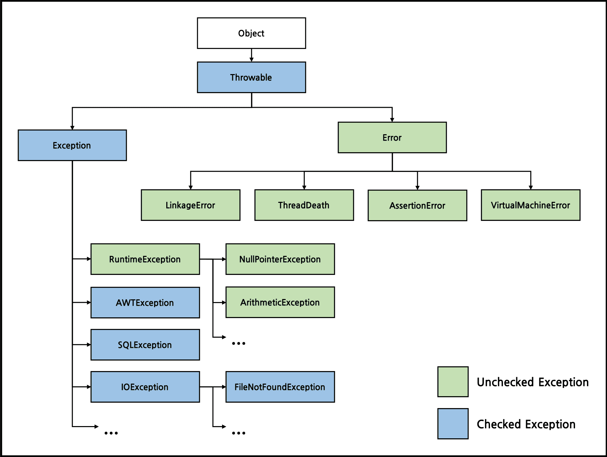

# 오류 처리

## 오류 코드보다 예외를 사용하라

- 오류 플래그를 설정하거나 오류 코드를 반환하는 대신 예외를 던지는 것이 낫다.
- 논리와 오류 처리 코드가 뒤섞이지 않아 호출자 코드가 깔끔해진다.

## try-catch-finally 문부터 작성하라

- try 코드를 실행하면 언제든 실행을 중단하고 catch로 넘어갈 수 있다.
- try에서 무슨 일이 생기든지 호출자가 기대하는 상태를 정의하기 쉬워진다.

## unchecked 예외를 사용하라



- 과거에는 checked 예외가 선호되었다.
    - 메서드 선언 시 반환할 예외를 모두 열거해야 했다.
    - 메서드에서 checked 예외를 던졌을 때 catch가 세 단계 위에 있다면 그 사이의 메서드 모두가 해당 예외를 정의해야 한다.
    - 결국 하위에서 코드를 변경하면 상위까지 변경해야 해서 OCP를 위반한다.

## 예외에 의미를 제공하라

- 실패한 코드의 의도를 파악하려면 오류 메시지에 정보를 담아 예외를 던진다.
- 실패한 연산 이름과 실패 유형 등도 언급한다.

## 호출자를 고려해 예외 클래스를 정의하라

- 위치, 발생한 컴포넌트 등 여러 유형으로 나눌 수 있다.
- 하지만 오류를 잡아내는 방법으로 정의하는 것이 제일 좋다.

```java
public class Example {
    public static void main(String[] args) {
        ...

        try {
            port.open();
        } catch (DeviceResponseException e) {
            reportPortError(e);
        } catch (GMXError e) {
            reportPortError(e);
        }
    }
}
```

위의 코드 보다는,

```java
public class Example {
    public static void main(String[] args) {
        LocalPort port = new LocalPort();

        try {
            port.open();
        } catch (PortDeviceFailure e) {
            reportPortError(e);
        }
    }
}
```

이렇게 코드가 중복되지 않도록 간결하게 하는 것이 좋다.

```java
public class LocalPort {
    public void open() {
        try {
            ...
        } catch (DeviceResponseException e) {
            reportPortError(e);
        } catch (GMXError e) {
            reportPortError(e);
        }
    }
}
```

그리고 원래 있던 세분화된 예외는 LocalPort 클래스 안에 감싸준다. 외부 API를 사용할 때는 이렇게 감싸주어야 의존성이 줄어든다.

## 정상 흐름을 정의하라

```java
public class Example {
    public static void main(String[] args) {
        try {
            MealExpenses expenses = expenseReportDAO.getMeals(employee.getId());
            total += expenses.getTotal();
        } catch (MealExpensesNotFound e) {
            total += getMealPerDiem();
        }
    }
}
```

식비를 청구하지 않은 경우 일일 기본 식비를 총계에 더하는 로직이다. 예외 정의 때문에 논리를 쉽게 파악하기 힘들다.

### 특수 사례 패턴

- 클래스를 만들거나 객체를 조작해 특수 사례를 처리하는 방식
- 클래스나 객체가 예외를 캡슐화해서 처리하므로 클라이언트가 예외를 처리할 필요가 없어진다.

```java
public class Example {
    public static void main(String[] args) {
        MealExpenses expenses = expenseReportDAO.getMeals(employee.getId());
        total += expenses.getTotal();
    }
}

public class PerDiemMEalExpenses implements MealExpenses {
    public int getTotal() {
        // 기본 값으로 일일 기본 식비를 반환한다.
    }
}
```

ExpenseReportDAO가 MealExpense 객체를 반환하게 만들고 청구한 식비가 없을 떄 기본 식비를 반환하는 MealExpense를 반환한다.

## null을 반환하지 마라

```java
public class Example {
    public void registerItem(Item item) {
        if (item != null) {
            if (registry != null) {
                if (existing.getBill() != null) {

                }
            }
        }
    }
}
```

- 중간에 null 체크를 빼먹는 상황이 생길 수 있다.
    - null 확인이 누락되는 문제라 말하기 쉽지만 실상은 null이 너무 많아서 문제다.
- 메서드에서 null을 반환하고 싶다면 대신 예외를 던지거나 특수 사례 객체를 반환한다.

```java
public class Example {
    public static void main(String[] args) {
        List<Employee> employeeList = getEmployeeList();
        if (employeeList != null) {

        }
    }
}
```

이렇게 null을 반환하는 대신

```java
import java.util.Collections;

public class Example {
    public static void main(String[] args) {
        List<Employee> employeeList = getEmployeeList();
    }

    public List<Employee> getEmployeeList() {
        if (직원이 없다면){
            return Collections.emptyList();
        }
    }
}
```

getEmployeeList()에서 빈 객체를 반환하도록 한다. 이러면 코드가 깔끔해지고 NPE가 발생할 가능성도 줄어든다.

## null을 전달하지 마라

- 정상적으로 null을 반환해야 하는 API가 아니면 메서드로 null을 전달하지 않는다.

누군가가 함수에 null을 전달하면 NPE가 발생하므로 아래와 같이 두 가지 방식으로 해결할 수 있다.

```java
public class Example {
  public void method(Point p1, Point p2) {
    if(p1 == null || p2 == null) {
        throw InvalidArgumentException();
    }
  }
}
```

이 방법은 InvalidArgumentException을 처리할 코드가 따로 필요하다.

```java
public class Example {
  public void method(Point p1, Point p2) {
    assert p1 != null : "p1 should not be null";
    assert p2 != null : "p2 should not be null";
  }
}
```

assert 문을 사용하면 코드 읽기는 편하지만 근본 문제를 해결하지는 못한다. 여전히 누군가가 null을 전달하면 오류가 발생한다.

- 호출자가 실수로 null을 넘겨도 처리할 방법이 거의 없다.
- 애초에 null을 넘기지 않도록 정책을 정해야 한다.