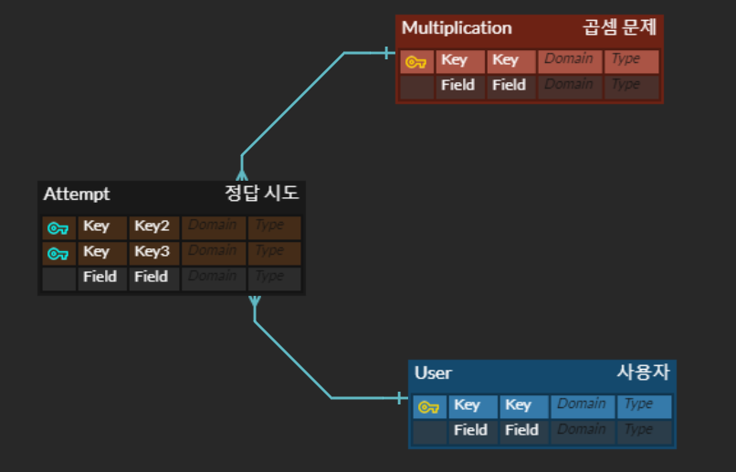

# 스프링부트를 활용한 마이크로서비스 개발

> 4월 3주차 기록  
> Ch 03 (56p~66p)

## 3. 3계층 스프링 부트 애플리케이션

본격적으로 데이터 계층에 대해 알아보자.

### 3-5-3. 데이터 레이어

- Hibernate 같은 ORM 프레임워크를 활용하면 Java 객체에 매핑할 수 있는 모델에 따라 데이터를 DB에 저장할 수 있다.
- 모델이 너무 복잡하지 않으면, ORM 프레임워크를 이용해 영속화 레이어를 간단하게 만들 수 있다.
- 예제가 간단하므로 Spring boot에서 제공하는 `Spring boot stater data jpa`를 활용해 JPA를 활용한다.
- JPA는 데이터를 영속화하는 명세이고 여러 구현체가 있다.(Hibernate가 그 중 하나)
- 특정 구현체에 종속되지 않게 표준을 사용하는 것이 좋다.

#### `pom.xml` 파일에 종속성 추가하기

```xml
    <dependency>
        <groupId>org.springframework.boot</groupId>
        <artifactId>spring-boot-starter-data-jpa</artifactId>
    </dependency>

    <dependency>
        <groupId>com.h2database</groupId>
        <artifactId>h2</artifactId>
        <scope>runtime</scope>
    </dependency>
```

- `spring-boot-starter-data-jpa` 종속성을 추가하면 저장소를 쉽고 빠르게 만들 수 있는 스프링 데이터 JPA 툴을 사용할 수 있다.
- 이 종속성은 하이버네이트를 이용해 JPA를 구현한다.
- h2 아티팩트는 H2라는 가벼운 내장 DB를 포함한다. MySQL, PostgreSQL 등 다른 DB 엔진을 사용할 수 있지만, 요구사항에 적합하고 설명하기 쉬운 H2를 사용한다.

#### `application.properties` 설정 추가하기

```yaml
# H2 데이터베이스 웹 콘솔에 접속
spring.h2.console.enabled=true
# 데이터베이스가 '없는 경우에만' 데이터베이스를 생성
spring.jpa.hibernate.ddl-auto=update
# 파일로 데이터베이스를 생성
spring.datasource.url=jdbc:h2:file:~/social-multiplication;DB_CLOSE_ON_EXIT=FALSE;
# 학습 목적으로 콘솔에 SQL을 출력
spring.jpa.properties.hibernate.show_sql=true
```

- yaml 포맷으로 사용하고 싶다면 `yml`로 파일명을 변경하고 내용을 조금만 수정해주면 된다.

> 실 운영을 준비한다면 MySQL 등 다른 DB로 설정해주는게 더 좋을 것 같다!

### 3-5-4. 데이터 모델

영속화 레이어를 완성하기 위해 데이터 모델을 설계한다.

앞서 비즈니스 개체를 정의했고, 데이터 관점에서 비즈니스 개체가 어떻게 연결되는지 고려해야한다.

- 데이터 모델이 도메인 모델과 일치하지 않을 수 있다!
- 예를 들면, **도메인**은 `CustomerWithPersonalDetails`와 `EmployeeWithPersonalDetails`로 나눈다.
- 하지만, 데이터 중복을 방지하고 공간을 절약하기 위해 **테이블**은 `customer`, `employee`, `personal_details`로 나눌 수 있다.
 
> 우리가 만드는 애플리케이션에서는 도메인 개체와 데이터 개체가 바로 매핑된다.  



복잡하지는 않지만 User 개체부터 살펴보자.

- 사용자는 여러 답안을 제출할 수 있다.
- 동시에 같은 숫자로 이뤄진 곱셈 문제에 여러 사용자가 답안을 제출할 수 있다.

#### JPA로 모델링해보기

애너테이션을 사용하면 쉽게 JPA로 모델링할 수 있다.

```Java
package microservices.book.multiplication.domain;

import lombok.EqualsAndHashCode;
import lombok.Getter;
import lombok.RequiredArgsConstructor;
import lombok.ToString;

import javax.persistence.Column;
import javax.persistence.Entity;
import javax.persistence.GeneratedValue;
import javax.persistence.Id;

/**
 * 애플리케이션에서 곱셈을 나타내는 클래스 (a * b)
 */
@RequiredArgsConstructor
@Getter
@ToString
@EqualsAndHashCode
@Entity
public final class Multiplication {

  @Id
  @GeneratedValue
  @Column(name = "MULTIPLICATION_ID")
  private Long id;

  // 두 인수
  private final int factorA;
  private final int factorB;

  // JSON/JPA 를 위한 빈 생성자
  Multiplication() {
    this(0, 0);
  }
}
```


```Java
package microservices.book.multiplication.domain;

import lombok.EqualsAndHashCode;
import lombok.Getter;
import lombok.RequiredArgsConstructor;
import lombok.ToString;

import javax.persistence.Column;
import javax.persistence.Entity;
import javax.persistence.GeneratedValue;
import javax.persistence.Id;

/**
 * 사용자 정보를 저장하는 클래스
 */
@RequiredArgsConstructor
@Getter
@ToString
@EqualsAndHashCode
@Entity
public final class User {

  @Id
  @GeneratedValue
  @Column(name = "USER_ID")
  private Long id;

  private final String alias;

  // JSON/JPA 를 위한 빈 생성자
  protected User() {
    alias = null;
  }
}
```

```Java
package microservices.book.multiplication.domain;

import lombok.EqualsAndHashCode;
import lombok.Getter;
import lombok.RequiredArgsConstructor;
import lombok.ToString;

import javax.persistence.*;

/**
 * {@link User}가 {@link Multiplication}을 계산한 답안을 정의한 클래스
 */
@RequiredArgsConstructor
@Getter
@ToString
@EqualsAndHashCode
@Entity
public final class MultiplicationResultAttempt {

  @Id
  @GeneratedValue
  private Long id;

  @ManyToOne(cascade = CascadeType.PERSIST)
  @JoinColumn(name = "USER_ID")
  private final User user;

  @ManyToOne(cascade = CascadeType.PERSIST)
  @JoinColumn(name = "MULTIPLICATION_ID")
  private final Multiplication multiplication;
  private final int resultAttempt;

  private final boolean correct;

  // JSON/JPA 를 위한 빈 생성자
  MultiplicationResultAttempt() {
    user = null;
    multiplication = null;
    resultAttempt = -1;
    correct = false;
  }

}
```


