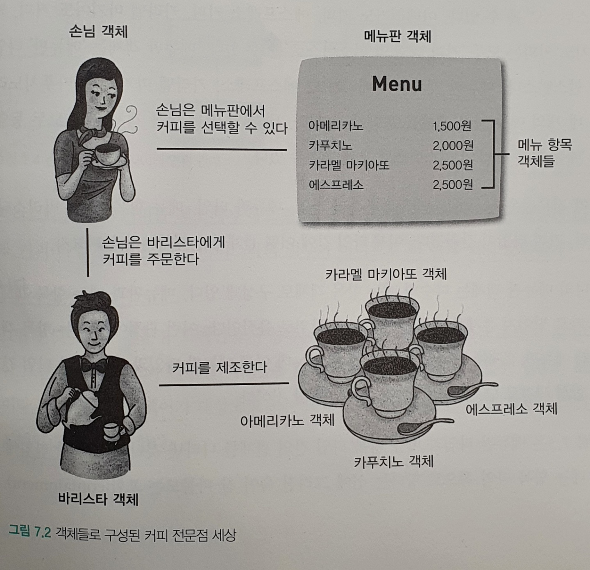
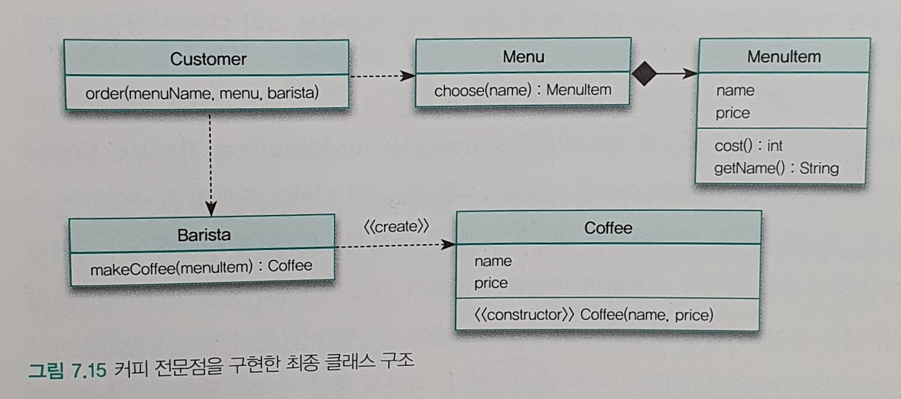

# 함꼐 모으기

## 개념 관점 설계

- 도메인 안에 있는 개념 간의 관계 표현
- 사용자가 도메인을 바라보는 관점을 반영한다.
- 실제 도메인 규칙과 제약을 최대한 유사하게 반영해야 한다.

### 도메인

- 사용자가 관심을 갖고 있는 특정 분야나 주제

소프트웨어는 도메인에 존재하는 문제를 해결하기 위해 개발된다.

## 명세 관점 설계

- 실제 소프트웨어의 객체 간 책임에 초점
- 객체의 인터페이스에 관심을 둔다.
- 객체가 협력을 위해 **무엇**을 할수 있는지 파악한다.

사용자의 영역인 도메인을 벗어나 개발자의 영역인 소프트웨어로 초점이 옮겨진다.

## 구현 관점 설계

- 책임을 **어떻게** 수행할 것인가에 초점
- 실제 작업을 수행하는 코드를 작성한다.
- 인터페이스 구현에 필요한 속성과 메서드를 클래스에 추가한다.

이 세 가지 설계는 순서대로 한다는 것이 아니라, 동일한 클래스를 세 가지 다른 방향에서 봐야하는 것을 의미한다. 클래스는 세 가지 관점을 모두 수용할 수 있도록 개념,
인터페이스, 구현을 함께 드러내야 한다.

# 커피 전문점 도메인



커피 점문점에는 메뉴판이 있고 그 안에 커피 메뉴가 적혀있다. 객체 지향의 관점에서 메뉴판과 메뉴 항목은 모두 하나의 객체다. 손님과 바리스타 역시 마찬가지다.

## 도메인 모델


이처럼 소프트웨어가 대상으로 하는 영역인 도메일을 단순화해서 표현한 모델을 도메인 모델이라고 한다.

### 포함/합성 관계

- 메뉴판과 메뉴 항목은 하나의 단위로 움직인다.
- 메뉴 항목은 메뉴판 객체에 포함되어 있다.
- 4는 메뉴 항목 개수를 의미한다.

### 연관 관계

- 손님 타입은 메뉴판 타입을 알고 있어야 주문을 할 수 있다.
- 손님 타입이 메뉴판 타입을 포함하는 관계가 아니므로 합성 관계는 아니다.
- 한 타입의 인스턴스가 다른 타입의 인스턴스를 포함하지는 않지만 서로 알고 있어야 하는 경우 연관 관계에 해당한다.

어떤 관계가 포함이고 연관인지보다, 어떤 타입이 도메인을 구성하고 있으며 타입들 간 어떤 관계가 존재하는지 파악하면서 도메인을 이해하는 것이 중요하다.

## 협력 찾기

- 객체 지향 설계는 객체가 아닌 협력을 설계하는 것이다.
- 메시지가 객체를 선택해야 한다.
    - 메시지를 먼저 선택하고 그 후에 수신하기에 적절한 객체를 선택한다.
- 메시지를 수신할 객체는 처리할 책임을 맡는다.
- 객체가 수신하는 메시지는 외부에 제공하는 공용 인터페이스에 포함된다.


메시지 위에 붙은 화살표는 인자를 의미한다. 각 객체는 능동적이고 자율적인 존재여서 현실과 달리 메뉴판도 스스로 메뉴 항목을 찾는다.

1. 각 메시지를 처리하기에 적합한 객체를 선택한다.
    - 도메인 모델 안에서 책임을 수행하기 적절한 타입을 찾는다.
    - 주문할 적절한 책임은 손님이 갖는다.
2. 스스로 할 수 없는 일이 있다면 다른 객체에게 요청한다.
    - 손님이 커피를 주문하는 도중에 메뉴 항목은 알지 못하므로 메뉴판에 메뉴 항목을 요청한다.
    - 메시지에 `메뉴 이름`이라는 인자를 담아 보낸다.
3. 메시지를 수신한 객체가 적절한 값을 반환한다.
    - 메뉴판은 `메뉴 이름`에 대항되는 `메뉴 항목`을 반환한다.

## 인터페이스 정리하기

- 객체가 수신한 메시지가 객체의 인터페이스를 결정한다.
- 수신 가능한 메시지만 추려내면 객체의 인터페이스가 된다.
- 메시지를 수신할 수 있다는 것은 그 객체의 인터페이스 안에 메시지에 해당하는 오퍼레이션이 있다는 것이다.
    - 손님 객체의 인터페이스에는 `주문하라`, 메뉴판 객체의 인터페이스에는 `메뉴 항목을 찾아라`와 같은 오퍼레이션이 있다.


- 객체의 협력은 실행 시간의 상황을 동적으료 표현한 모델이지만 실제 소프트웨어 구현은 정적인 타입으로 이루어진다.
- 따라서 객체를 포괄하는 타입을 정의한 후, 각 오퍼레이션을 타입의 인터페이스에 추가해야 한다.
    - 객체의 타입은 클래스로 구현한다.

```java
class Customer {

  public void order(String menuName) {
  }
}

class MenuItem {

}

class Menu {

  public MenuItem choose(String name) {
  }
}

class Barista {

  public Coffee makeCoffee(MenuItem menuItem) {
  }
}

class Coffee {

  public Coffee(MenuItem menuItem) {
  }
}
```

오퍼레이션은 public으로 선언되어야 한다. 오퍼레이션은 외부에서 접근 가능한 공용 인터페이스의 일부이기 때문이다.

## 구현하기


`Customer`는 `Menu`에게 `menuName`에 해당하는 `MenuItem`을 요청해야 한다. 이 `MenuItem`을 받아 `Barista`에게 커피 제조를 요청한다.

`Customer`가 `Menu`객체와 `Barista` 객체에 어떻게 접근할 수 있을까? 다른 객체에게 메시지를 전송하려면 참조를 알고 있어야 한다. 여기서는 메서드 인자로 객체 참조값을 전달받는다.

```java
// 참조 값을 받기 위해 인터페이스를 변경했다.
class Customer {
  public void order(String menuName, Menu menu, Barista barista) {
    MenuItem menuItem = menu.choose(menuName);
    Coffee coffee = barista.makeCoffee(menuItem);
  }
}
```

이렇듯 구현 도중에 객체의 인터페이스가 변경될 수 있다는 점을 유의해두자. 협력을 구상할 때 너무 설계에 시간을 쏟지 말고 최대한 코드를 빨리 구현해서 이상이 없는지 판단해야 한다.

```java
class Menu {

  private List<MenuItem> items;
  
  public Menu(List<MenuItem> items) {
    this.items = items;
  }
  
  public MenuItem choose(String name) {
    for(MenuItem each : items) {
      if(each.getName().equals(name)) {
        return each;
      }
    }
    return null;
  }
}
```

`Menu`는 `menuName`에 해당하는 `MenuItem`을 찾는 책임이 있다. 따라서 `Menu`가 `MenuItem`을 관리하고 있어야 한다.

`MenuItem`을 `Menu`의 속성으로 포함시킨 결정도 클래스 구현 도중에 내려졌다. 인터페이스는 캡슐화가 목적이므로 객체의 내부 속성을 알아서는 안된다. 인터페이스를 결정할 때는 객체 내부에 어떤 가정도 하지 않고 책임에 대한 결정만 내린다. 책임이 결정된 후에야 수행에 필요한 속성을 결정하자. 

```java
class Barista {
  public Coffee makeCoffee(MenuItem menuItem) {
    Coffee coffee = new Coffee(menuItem);
    return coffee;
  }
}
```

`Barista`는 `MenuItem`으로 커피를 제조한다.

```java
class Coffee {
  private String name;
  private int price;
  
  public Coffee(MenuItem menuItem) {
    this.name = menuItem.getName();
    this.price = menuItem.cost();
  }
}
```

`Coffee`는 자기 자신을 생성하기 위해 생성자를 제공한다. 이름과 가격 속성으로 `MenuItem`에 요청을 보내 커피 이름과 가격을 얻은 후 `Coffee`의 속성에 저장한다.

```java
public class MenuItem {
  private String name;
  private int price;
  
  public MenuItem(String name, int price) {
    this.name = name;
    this.price = price;
  }
  
  public int cost() {
    return price;
  }
  
  public String getName() {
    return name;
  }
}
```

`MenuItem`은 `getName()`과 `cost()` 메시지에 응답할 수 있도록 메서드를 구현한다.

`MenuItem`의 오퍼레이션은 구현 단계에 와서야 식별되었다. 상호 작용을 해봐야 인터페이스 모습을 제대로 알 수 있다. 설계를 간단히 끝내고 최대한 빨리 구현에 돌입하자.



최종 클래스 구조는 이렇게 되었다.

## 코드와 세가지 관점

앞서 작성한 코드를 세 가지 관점에서 분석해보자.

### 개념 관점

클래스를 바라본다.

- `Barista`, `Menu` 등 각 클래스 이름이 커피 도메인을 구성하는 개념과 관계를 반영한다.
    - 커피 제조 과정을 변경해야 한다면 `Barista`에서 작업해야 하는 것을 바로 알 수 있다.
- 소프트웨어의 클래스와 도메인 클래스의 간격이 좁을 수록 기능 변경을 위한 코드도 줄어든다.
    
### 명세 관점

클래스의 인터페이스를 살펴본다.

- public 메서드는 협력할 수 있는 공용 인터페이스를 드러낸다.
- 공용 인터페이스는 외부 객체가 해당 객체에 접근할 수 있는 유일한 통로다.
- 구현과 관련된 세부 사항이 드러나지 않아야 한다.

### 구현 관점

클래스의 내부 구현을 바라본다.

- 클래스의 메서드와 속성은 구현이다. 인터페이스의 일부가 아니다.
- 따라서 메서드와 속성은 외부 객체에 영향을 미치면 안된다.
- 즉, 클래스 내부로 캡슐화되어야 한다.

## 인터페이스와 구현을 분리하라

명세 관점과 구현 관점이 섞이지 못하도록 해라.

명세 관점은 클래스의 안정적인 측면을 나타낸다. 구현 관점은 클래스의 불안정한 측면을 드러낸다. 이 둘을 분리하는 것은 중요하다.
